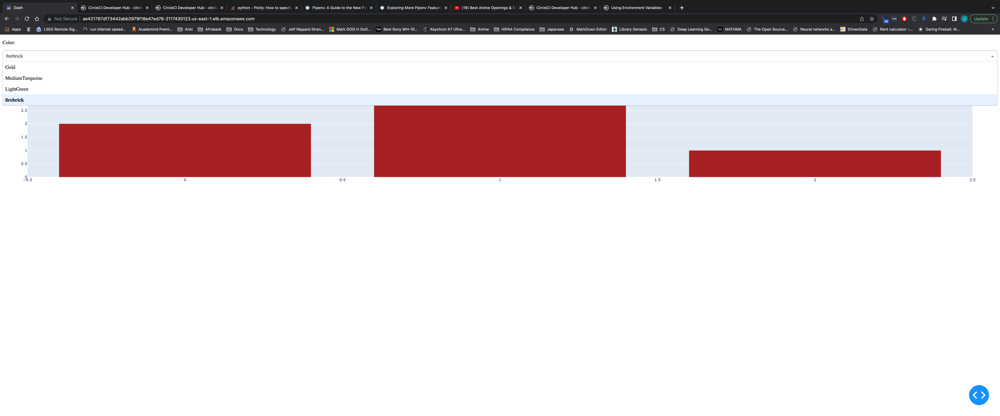
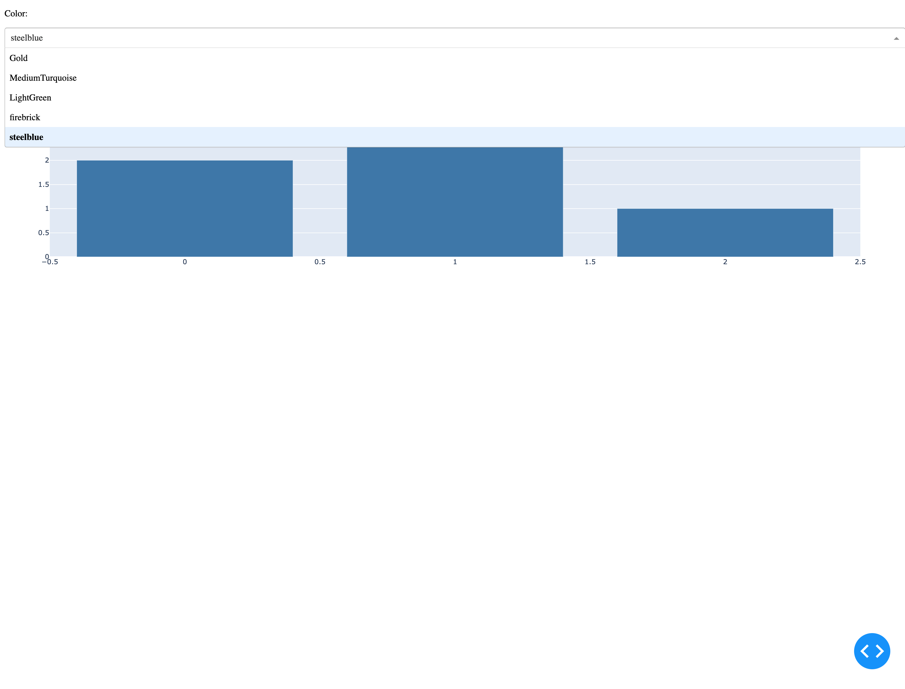
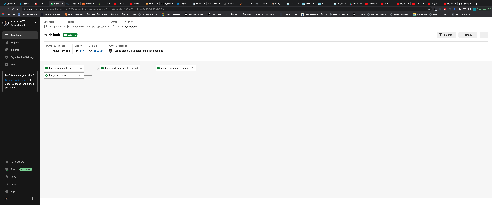
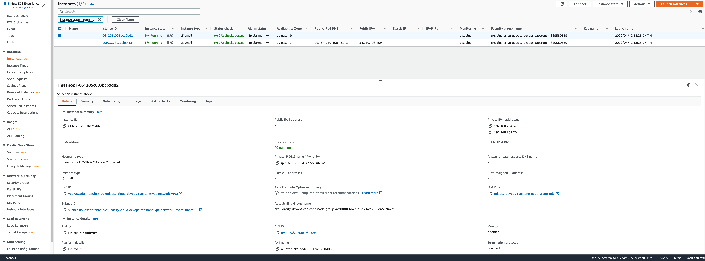
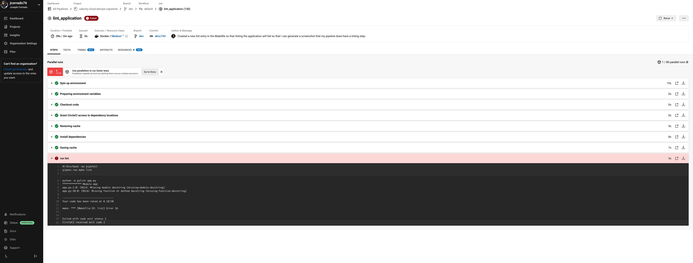

## Cloud DevOps Capstone Project
In this project, we'll develop a web application that will be deployed onto a kubernetes cluster of our choosing, and integrated with a CI/CD server.
Finally, we'll make use of docker format containers by uploading our images to DockerHub.

The web app for this project so far is just a simple toy dash plotly dashboard. 
## The Repository
The GitHub repository for this codebase can be found [here](https://github.com/jcorrado76/udacity-cloud-devops-capstone)

The diagram for the build can be found at a view-only LucidChart link [here](https://lucid.app/documents/view/8ab539b0-a370-4d81-99f1-a74ef6e629bd)
# Blue Green Deployment
The deployment strategy for this project was to use a blue-green deployment. 
This means, I push a new image to DockerHub, and then the kubernetes cluster tries to fill all the current pods with the new image
immediately. If the deployment fails, I roll back to the previous image.

Here is an example screenshot of the first version:


In this version, we have 4 possible colors for our bar plot. 
What we're going to do in the next deployment is add a new color to the bar plot. 
We're going to add `steelblue` as a new color.
As far as application development goes, this only involves adding a single string to a list in the `MARKER_COLORS` list in our application code.

Then, we'll re-build our docker image and deploy the new version to the kubernetes cluster.

Here is what the app looks like after adding the new color:


And, here's what the CI/CD pipeline looked like when I ran this:


Here is the page with the EC2 instances that were deployed as part of the AWS Nodegroup, and were associated with the kubernetes cluster:


Here is the screenshot where I intentionally failed the application linting stage by making the pylint 
command more strict to get a screenshot of a failed linting step:

# Local Development
For local development, when I am done adding new application code, I just run:
```bash
make docker_image
make webapp
```
To build the docker image, and then launch the app locally so I can test it out on my local browser to make sure it works. 
# Creating the EKS Cluster
1. Go into EKS, and create a cluster
2. Create an IAM role for EKS (the EKS - Cluster use case) with the following policies:
    * AmazonEKSClusterPolicy
3. Attach the role created to the cluster
4. Now we need to create networking:
    * Go to CloudFormation
    * Create Stack
    * Template is ready
    * Amazon S3 URL
    * Go to [this link](https://docs.aws.amazon.com/eks/latest/userguide/creating-a-vpc.html#create-vpc) and grab the URL for Public and private subnets
    * Paste that URL into the CloudFormation template, and hit next
    * Give the stack a name and create it
5. Now select the VPC that was created, and use it for the cluster. Check that the subnets that were created are also being used.
6. For Cluster endpoint access, choose Public and Private so that the cluster will be accessible from outside the VPC, while worker node traffic to the endpoint will stay within the VPC.
7. Now we need to configure your ~/.kube/config file to point to the new EKS cluster:
    1. Create a copy of your previous ~/.kube/config file (~/.kube/config.old)
    2. Wait until your EKS cluster is created
    3. Then run `aws eks --region <region-name> update-kubeconfig --name <cluster-name>` (remember to check the region your cluster is in!!)
8. Now we need to add a node group (our worker nodes):
    1. Create the IAM role for the EC2 use case with the appropriate policies:
        * AmazonEKSWorkerNodePolicy
        * AmazonEKS_CNI_Policy
        * AmazonEC2ContainerRegistryReadOnly
    2. Create a node group with a name and the role we just created:
        * Amazon Linux 2
        * t3.small (use small here, not micro - scheduling can fail if your instance can't handle the load)
        * Leave the auto-scaling to its default (desired 2, min 2, max 2)
        * Then go to networking, and make sure the subnets match the ones in your VPC
        * Then create the node group
        * Wait until your node group becomes Active
9. Now apply your kubectl yaml files:
Check the current context in use with:
```bash
kubectl config current-context
```
Read more about context configurations [at this link](https://kubernetes.io/docs/reference/kubectl/cheatsheet/#kubectl-context-and-configuration)

```bash
kubectl apply -f=<kubectl-yaml-file>
```
10. Check that it worked with:
```bash
kubectl get deployments
kubectl get pods
kubectl get services
```
When you run that last one, now our external-IP should be the URL we go to to access the dashboard.

Then, you should be able to navigate to that URL and see your dashboard!
# Debugging
Read [this article](https://komodor.com/learn/how-to-fix-errimagepull-and-imagepullbackoff/) for useful tips on how to debug when
you have an error pulling an image.

They describe how to check which particular error was raised when pulling the image as well. 
# Pipfile
In this project, I've kept the Pipfile extremely simple. It's essentially a minimal example of a pipfile that can be used to spin up 
a dash dashboard, and lint the python application code.

Note that in this project, the dashboard is a single python file. 
In addition, note that in our pipfile, we've relaxed our python version so that it requires `3.10`, not `3.10.4`.
When you do it like this, Pipenv will allow any patch of python `3.10` to work.
# Dockerfile
First, we're starting off with Python:3.10-slim as our base image. There isn't any particular reason for this base image, 
and it can probably be optimized to be smaller and have a smaller security surface area.

First, we copy our Pipfile, Pipfile.lock and Makefile into the working directory of our docker image. This will
allow us to cache the code resulting from copying and installation of dependencies separately from updates made to the application. 

Note that we don't need `PIPENV_VENV_IN_PROJECT=1` in the Dockerfile. This causes the virtual environment created by Pipenv to be saved
in a `.venv` directory inside the project directory, which is what we'll be caching and using.

I suppose in this step, it's actually not necessary, since essentially each layer of the entire docker container is cached, so even if we didn't
specify this environment variable, we'd still get the caching functionality if our virtual environment were saved into a shared location.
Note that we need to do it this way when running our tests and whatnot since we're only using the CI/CD caching functionality when running our tests.
This can probably be remedied by using a dedicated docker container for running our tests, and creating a base image that our testing container
depends on, and that our final deployed image depends on.
