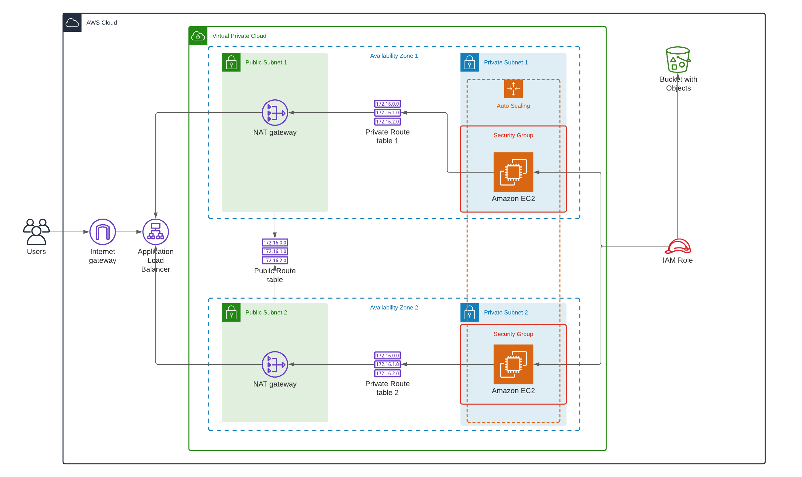

### Highly Available (HA) Web Application deployed using CloudFormation
***
In this project, we'll deploy an Apache Web Server using a highly-available architecture on AWS using CloudFormation templates. We will create
and deploy the infrastructure and application for our app, Udagram, using infrastructure as code. Our CloudFormation template will
deploy all of the necessary infrastructure for the application, and the application code (JavaScript and HTML) will be stored in S3.

The scenario is that, the developers in our company have pushed code into a zip file in S3, and they want us to deploy the application,
along with the necessary software onto the infrastructure.

This should be done in an automated fashion so that the infrastructure can be discarded as soon as the testing team finishes
their tests and gathers their results.

### Description
***
We need to:
* Create a launch configuration for the application servers
* Create an auto-scaling group that uses the launch configuration
* Deploy 4 servers, two each in a private subnet:
    * at least 2 vCPUs
    * at least 4 GB RAM
    * Ubuntu 18
    * at least 10 GB disk space

#### Diagram
***

## Usage
***
To launch the highly available website, simply navigate to the directory, and run:
```bash
make network
make server
```


